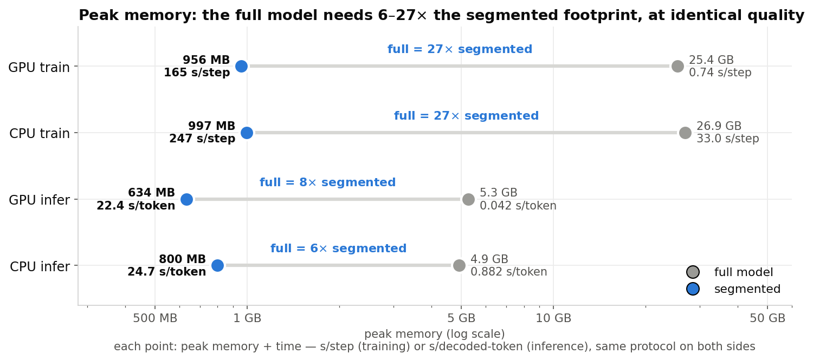
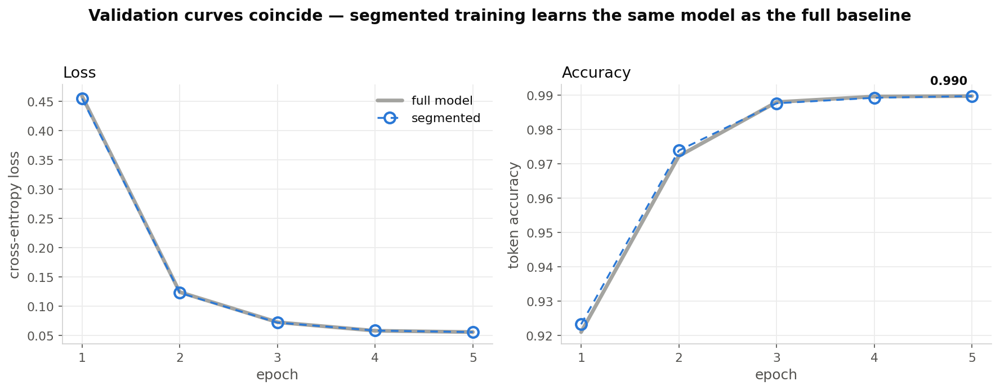
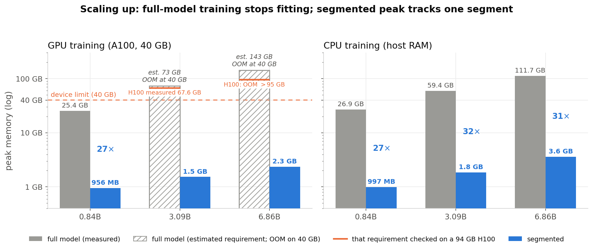

# Memory is a Budget, not a Barrier

**Quality-preserving segmented training and inference of LLMs under minimal resources.**

This repository contains the complete, self-contained code, data, and results to
reproduce every experiment, table, and figure in the paper. A GPT decoder is partitioned
along four axes — embedding width, attention head-groups, feed-forward hidden units, and
output vocabulary — and executed **one segment at a time**, streaming exactly one segment
onto the constrained device while every other segment, gradient, and optimizer moment is
parked in a backing store. With stochastic layers disabled the segmented run reproduces
full-model execution to machine precision (gradients ≈1e-7, one AdamW step ≈1e-8,
reassembly bitwise); with dropout on it trains to the same final accuracy to every
recorded digit, while peak training memory drops ≈27× on GPU and ≈27× on CPU.

The learning is invariant; only the memory schedule changes.

---

## Results at a glance

Segmented execution collapses peak memory by 6–27× across training and inference, on GPU
and CPU:



…at identical quality — the segmented and full-model validation curves coincide:



…and the gap widens with scale, past the point where full-model training fits the device
at all:



All 12 paper figures regenerate from the committed result JSONs in seconds (§4).

---

## Repository layout

```
src/sequential_segmented_llm_training_inference/   the library (full model + reference engine, data, export)
scripts/                                          library drivers (segmented train / infer, ONNX export / infer)
tests/                                            433 unit + integration tests (pytest)
configs/                                          model / segmentation / runtime configs
bpe_tokenizer/ , gpt2_tokenizer/                  tokenizers (BPE-2k small model, GPT-2 large model)
log_lines/                                        dataset (raw logs, processed, generative splits)
environment_versions.txt                          exact package versions of the measurement environment
final_paper_scripts_results/
├── full_model/                                   full-model baseline: scripts, SLURM, result JSONs, figures
└── segmented_model/
    ├── segmentation_management/                  segmented execution engine (flat-import port)
    ├── scripts/                                  segmented train / inference / cost / ONNX drivers
    ├── memory_reduction_techniques/              technique ablation, scale study, baselines (+ results, figures)
    │   ├── results/                              every committed result JSON
    │   ├── results/figures/paper/                the paper's figures
    │   └── slurm/                                the SLURM job files for every run
    ├── outputs/                                  committed result metrics (JSON)
    └── slurm/                                    SLURM batch scripts
```

> **Not committed (regenerable):** trained checkpoints, offloaded segment stores
> (`_work/`, `*.pt`), exported dense/ONNX model weights (`onnx/`, `*.onnx`, `*.weights`,
> `*.npz`), and SLURM stdout/stderr logs. These are recreated by re-running the training /
> export scripts and are listed in `.gitignore`. Everything needed to **regenerate them** —
> and all result *metrics* and figures — is committed.
>
> **Profiler timelines.** The cost runs record a per-sample memory trace
> (`vram_timeline` / `cpu_ram_timeline` / `moves`, up to half a million samples per run).
> Those arrays are kept only for the four traces plotted in `comp_memflow`
> (`SEG/seg_cost_{gpu,cpu}`, `SEG/seg_b2_{gpu,cpu}`, `RES/scale_cpu_large/seg_train_metrics.json`);
> elsewhere they are omitted and the file carries a `timelines_omitted` note. Every
> aggregate the paper quotes — `overall`, `per_phase`, `per_operation`, `baseline`,
> `avg_step_time_s` — is committed in full, and re-running the producing script
> regenerates the complete trace.

---

## 1. Environment

Python 3.10, PyTorch 2.7.0 (CUDA 12.8, cuDNN 9.7.1) on Rocky Linux 8.10 (CUDA toolkit
12.8.2, GCC 13.2.0). Dependencies are pinned in `pyproject.toml` / `poetry.lock`:

```bash
poetry env use python3.10
poetry install
```

`environment_versions.txt` is a `pip freeze` of the exact environment used for the
measurements, and pins the versions the paper quotes (`torch==2.7.0+cu128`,
`transformers==5.12.0`, `tokenizers==0.22.2`, `numpy==2.2.6`, `psutil==7.2.2`,
`onnx==1.22.0`, `nvidia-cudnn-cu12==9.7.1.26`). The torch-free inference path was measured
with ONNX Runtime 1.23.2 (`onnxruntime-gpu`, which provides **both** the CPU and CUDA
execution providers — do not also install plain `onnxruntime`, they conflict).
Note: the committed lock resolves a newer `onnxruntime-gpu` 1.x than the measured
1.23.2; install `onnxruntime-gpu==1.23.2` to match the measured configuration exactly.

### Optional dependency: DeepSpeed (ZeRO-Offload baseline only)

The ZeRO-Offload comparison of §6.2 needs **`deepspeed==0.19.2`**, which is *not* part of
`pyproject.toml` and is deliberately kept out of the lock file: DeepSpeed pulls a large
CUDA/JIT toolchain and is only used by one script. Install it into a **separate
virtualenv** built on the same `torch==2.7.0+cu128` wheel:

```bash
python3.10 -m venv .venv-deepspeed
.venv-deepspeed/bin/pip install torch==2.7.0+cu128 --index-url https://download.pytorch.org/whl/cu128
.venv-deepspeed/bin/pip install deepspeed==0.19.2
```

and point the job at it: `PYTHON=$PWD/.venv-deepspeed/bin/python sbatch .../mrt_deepspeed_baseline.sbatch`.
Nothing else in the repository imports DeepSpeed.

### Running the SLURM job files

Every `*.sbatch` under `final_paper_scripts_results/**/slurm/` is the exact invocation used
for the corresponding result, with the site-specific paths replaced by two environment
variables:

```bash
export PROJECT_ROOT=$PWD                 # the repository root
export PYTHON=$(poetry env info -e)      # optional; defaults to `python` on PATH
cd "$PROJECT_ROOT" && sbatch final_paper_scripts_results/.../slurm/<job>.sbatch
```

Submit from the repository root: the `--output` / `--error` paths are relative to the
submit directory. The `#SBATCH --partition` / `--gres` / `--constraint` / `--cpus-per-task`
directives and the `module load`, `OMP_NUM_THREADS` and `MALLOC_*` lines are **left intact
as measurement provenance** (§3) — adapt them to your site's partition names.

---

## 2. Data

The dataset is a system-log labeling task rendered as next-token generation (the log line
is the prompt, the model generates its `Issue: …, level: …` label). The splits are
committed under `log_lines/generative_splits/{train,validation,test}.csv` — 32,569 /
11,521 / 11,655 lines including the header row — so every experiment runs out of the box.
`log_lines/*.csv` are the raw per-node exports and `log_lines/processed_data/` their
cleaned form.

To regenerate the splits from the raw logs:

```bash
cd src/sequential_segmented_llm_training_inference/data
python create_generative_splits.py     # raw log_lines/*.csv -> generative_splits/{train,validation,test}.csv
```

Tokenizers are committed; the BPE-2k tokenizer can be retrained with
`bpe_tokenizer/train_bpe.py`.

> **Pseudonymization note.** The logs were collected from a production compute cluster.
> Before release, the machine names were replaced by a deterministic pseudonym mapping
> (`node01 … node09`), both in the per-node file names and wherever a machine name occurs
> inside a file (the `source_file` column of the splits, and the `instance="…"` field of
> the raw log text). The substitution is a pure string replacement: row counts, column
> structure and label distributions are unchanged, and the mapping is not published.
> All comparisons in the paper — full vs. segmented equivalence in particular — put the two
> implementations on **identical data**, so they are unaffected by the renaming. If a model
> is retrained on the released (pseudonymized) text, exact token statistics may differ
> marginally from the internal runs, because the substituted strings tokenize slightly
> differently.

---

## 3. Measurement environment (mirrors §5 of the paper)

Every number in the paper is a peak recorded by the repository's own profiler, which
samples device VRAM and host RSS on one synchronized clock and annotates every segment
load/release. GPU peak VRAM is a no-miss allocator high-water mark reset per phase; host
RSS is the per-configuration sampled peak (deliberately **not** `ru_maxrss`, which is
monotonic across configurations run in one process). Training is measured at batch 4,
sequence 512, over three steps after a warm-up; inference at a 256-token prompt with 8
decoded tokens.

Three environment facts materially affect the numbers, and every job file encodes them:

- **CPU thread pinning, and the SLURM-prolog trap.** CPU jobs request
  `--cpus-per-task=16` **and** export `OMP_NUM_THREADS=16`. The cluster's SLURM prolog
  otherwise leaves `OMP_NUM_THREADS=1`, which serializes PyTorch's CPU GEMMs and inflates
  every CPU time by roughly an order of magnitude. This is the practical trap that forced
  the CPU series to be re-measured (§4c below); `rerun_D_oldenv_control.sbatch` is the
  control that reproduces the old, unpinned behaviour on purpose.
- **glibc allocator settings.** CPU jobs additionally fix
  `MALLOC_MMAP_THRESHOLD_=MALLOC_TRIM_THRESHOLD_=131072`, because peak host RSS is
  allocator-policy sensitive: the same workload measured **3.8× apart** with and without
  these settings. Every compared CPU cell uses one identical environment.
- **GPU node classes.** Results are labeled by node *class* — A100-40 GB, A100-80 GB,
  H100-94 GB — and every compared pair is measured within one class. Each run records the
  device capacity in its metrics JSON (`device_total_mb`: 40442 for A100-40, 81154 for
  A100-80, 95330 for H100), so the class of any committed result is verifiable after the
  fact. **On this cluster `--constraint=40gb_vram` means "≥ 40 GB"**, so the 80 GB nodes
  satisfy it too; pinning the true A100-40 class additionally requires excluding the 80 GB
  node names. The job files that need it carry a comment at that point explaining where a
  site-specific `#SBATCH --exclude=…` goes (the original node names are not published).

---

## 4. Regenerate the paper figures (seconds, CPU-only)

All 12 paper figures are rebuilt from the committed result JSONs — no GPU, no training:

```bash
cd final_paper_scripts_results/segmented_model/memory_reduction_techniques
python scale_summary.py       # -> results/scale_summary.json  (scale table; run first)
python general_fit.py         # -> results/general_fit.json    (general size+partition law)
python comparison_figures.py  # comp_learning, comp_cost_dumbbell, comp_onnx, comp_granularity, comp_memflow
python paper_figures.py       # fig1_schematic, fig2_waterfall, fig4_pareto, fig5_loo, fig7_phase (+ extras)
python scale_figures.py       # comp_scale_memory, comp_scale_model
# -> results/figures/paper/*.png
```

See **[REPRODUCE.md](REPRODUCE.md)** for the exact figure → script → source-JSON mapping
and for the provenance of every headline number.

---

## 5. Regenerate the results

Every experiment is a plain Python entry point; the matching `*.sbatch` wraps it with the
environment of §3. Run all commands from the repo root, offline:

```bash
export HF_HUB_OFFLINE=1 TRANSFORMERS_OFFLINE=1
```

Two model sizes (see `memory_reduction_techniques/segmentation_management/config.py`
presets): `small_8x2x2x8` (BPE-2k) for the **accuracy-equivalence** experiments (CPU or a
modest GPU); `large_8x2x2x8` (≈0.84B, GPT-2 vocab) for the **memory/time cost**
experiments (A100-class GPU or a large-RAM CPU node). The scale study adds
`xl15b_*`, `xl3b_*`, `xl5b_*`, `xxl7b_*`.

### 5a. Accuracy equivalence — full vs segmented learn the same model (feeds `comp_learning`)

```bash
# full-model baseline: train + record loss/accuracy per epoch
PYTHONPATH=src python final_paper_scripts_results/full_model/scripts/full_model_train_gpu.py \
    --device cuda --epochs 5 --batch-size 64          # -> full_model/outputs/train_gpu/metrics.json

# segmented training, then evaluation on the FULL test set
python final_paper_scripts_results/segmented_model/scripts/seg_train_gpu.py \
    --device cuda --epochs 5 --batch-size 64 --store-kind cpu_ram \
    --out-dir final_paper_scripts_results/segmented_model/outputs/seg_train_gpu_pathb
python final_paper_scripts_results/segmented_model/scripts/seg_infer_gpu.py \
    --checkpoint .../seg_train_gpu_pathb/checkpoints/best.pt \
    --device cuda --num-test -1 --batch-size 64 \
    --out-dir final_paper_scripts_results/segmented_model/outputs/seg_b1_pathb
```

CPU twins: `full_model_train_cpu.py` and `seg_train_cpu.py` (same flags, `--device cpu`).

### 5b. Cost at 0.84B, and the 11-technique ablation

Drivers in `final_paper_scripts_results/segmented_model/memory_reduction_techniques/`:

```bash
python gpu_train_cost.py     --preset large_8x2x2x8 --device cuda   # -> results/gpu_train/ladder_train.json
python cpu_train_cost.py     --preset large_8x2x2x8 --device cpu    # -> results/cpu_train/ladder_train.json
python gpu_inference_cost.py --preset large_8x2x2x8 --device cuda   # -> results/gpu_inference/ladder_infer.json
python cpu_inference_cost.py --preset large_8x2x2x8 --device cpu    # -> results/cpu_inference/ladder_infer.json
python loo_cost.py           --preset large_8x2x2x8 --device cuda   # -> results/gpu_train_loo/loo_train.json
python granularity_cost.py   --device cuda                          # -> results/gpu_granularity/granularity_train.json
python full_decode_cost.py   --preset large_8x2x2x8 --device cuda   # -> results/full_decode_gpu/full_decode_metrics.json
```

SLURM: `slurm/mrt_{gpu,cpu}_{train,inference,loo}.sbatch`, `mrt_gpu_granularity.sbatch`,
`mrt_full_decode.sbatch`.

### 5c. The experiments added after the first release

| Experiment | Driver | SLURM | Results |
|---|---|---|---|
| **Scale study, GPU** — 0.84B / 1.57B / 3.09B / 5.12B / 6.86B, partition fixed at 8×2×2×8 | `scale_cost.py --preset {xl3b,xl5b,xl15b,xxl7b}_8x2x2x8 --device cuda --run {full,seg}_{train,infer}` | `mrt_gpu_scale_3b.sbatch`, `mrt_gpu_scale_7b.sbatch`, `mrt_gpu_scale_fitpoints.sbatch` | `results/scale_gpu_*` |
| **Scale study, CPU** | `scale_cost.py … --device cpu` | `mrt_cpu_scale_3b.sbatch`, `mrt_cpu_scale_7b.sbatch` | `results/scale_cpu_xl3b`, `results/scale_cpu_xxl7b` |
| **OOM protocol** — at 3.1B/6.9B on the 40 GB card the full-model step aborts out-of-memory during its first step; the abort is *caught and recorded as the measurement* (`"OOM(warmup)"`), never silently retried at a smaller batch | same as above | same | `results/scale_gpu_{xl3b,xxl7b}/full_train_metrics.json` |
| **H100 validation of the OOM estimates** — the estimated requirement behind each abort is then tested on a 94 GB H100: 3.1B fits and measures 67.6 GB, 6.9B aborts above 95 GB | `scale_cost.py --run full_train` | `mrt_h100_scale_validate.sbatch` | `results/scale_h100_xl3b`, `results/scale_h100_xxl7b` |
| **DeepSpeed ZeRO-Offload baseline** — same model, protocol and precision; ZeRO-2 and ZeRO-3 with CPU offload, no activation checkpointing, `torch` AdamW client optimizer | `deepspeed_cost.py --mode {zero2,zero3}_offload` | `mrt_deepspeed_baseline.sbatch` (original, 8 CPUs) | `results/deepspeed_baseline` |
| **…three-node repetition protocol** — the baseline is re-run under the paper's 16-pinned-thread environment on **three distinct A100-40 nodes**, because the ZeRO optimizer runs on CPU threads. Peak was bit-identical across the three; step time was not, so each ZeRO point is plotted as the **median with a bar spanning the node-to-node spread** | `deepspeed_cost.py` | `rerun_B_deepspeed_16t.sbatch` (+`_v2`), `rerun_ds_16t_rep1.sbatch`, `rerun_ds_16t_rep2.sbatch` | `results/deepspeed_baseline_16t{,_rep1,_rep2}` |
| **Pre-registered cell** — the general memory/time law is fitted on the granularity sweep + the scale series, then tested out of sample on a **new size and a new partition at once** (3.09B @ 16×4×4×16). The prediction (466 s, 1162 MB) was committed *before* the job ran; measured 351 s / 1190 MB, i.e. memory within −2.4% and the additive time law an upper bound | `general_fit.py` (predicts), `scale_cost.py --preset xl3b_16x4x4x16` (measures) | `mrt_gpu_validate_cell.sbatch` | `results/general_fit.json`, `results/scale_gpu_xl3b_16x4x4x16` |
| **Naive-segmented anchor** — the partition with every technique off (tech code `00000000000`, dropout 0.1), measured on GPU and CPU; the reference point that isolates what the six always-on bounds buy (Table V naive row, Table VI anchor rows) | `measure_one.py --tech-code 00000000000` | `exp2_anchor_gpu.sbatch`, `exp2_anchor_cpu.sbatch`; summarized by `table_enrichment.sbatch` | `results/exp2_anchor/{gpu,cpu}_rep*/naive_anchor_met.json`, `results/table_enrichment.json` (`naive_anchors`) |
| **0.84B CPU re-measurement** — the 0.84B CPU cells are re-measured under the *same* 16-pinned-thread + fixed-malloc environment as the 3.09B/6.86B CPU cells, so the CPU column of the scale table is internally consistent | `scale_cost.py --preset large_8x2x2x8 --device cpu` | `mrt_cpu_full084_rerun.sbatch`, `rerun_A_cpu_bundle.sbatch` | `results/scale_cpu_large` |
| **Old-environment control** — the identical script and workload under the *old* environment (8 CPUs, `OMP_NUM_THREADS` unset, no MALLOC tuning), to prove the correction is environment-caused and not script-caused | `scale_cost.py` | `rerun_D_oldenv_control.sbatch` | `results/scale_cpu_large_oldenv` |
| **A100-40 inference ladder** — the GPU segmented-inference ladder re-run pinned to the A100-40 class, so it shares a node class with its comparison partners | `gpu_inference_cost.py` | `rerun_C_gpu_infer_a40.sbatch` (+`_v2`) | `results/gpu_inference_a100_40` |
| **Full-model decode reference** — full-model decoding timed under the *identical* prompt-and-decode protocol as the segmented side | `full_decode_cost.py` | `mrt_full_decode.sbatch` | `results/full_decode_{gpu,cpu}` |

### 5d. Quick GPU-free sanity check (small model, minutes)

```bash
cd final_paper_scripts_results/segmented_model/memory_reduction_techniques
python cpu_train_cost.py     --preset small_8x2x2x8 --device cpu --n-steps 1     --out-dir results/smoke_train
python cpu_inference_cost.py --preset small_8x2x2x8 --device cpu --gen-tokens 4  --out-dir results/smoke_infer
```

---

## 6. Tests

```bash
poetry run pytest -q      # 433 passed, 1 skipped
```

The suite covers the segmentation identities (attention concat, MLP running sum, chunked
cross-entropy), the recomputation backward, the segment stores and loader, RNG capture and
restore, segment-wise AdamW, checkpointing, the YAML protocol export/import, and the
full-model export parity that underpins the equivalence claims.

---

## Citation / license

MIT (see `LICENSE`). The paper is not part of this repository; this is the artifact it
points to.

- **Long-horizon validation (exp8/exp9)**: every headline training and serving mode run for 128-2,048 consecutive steps / 500-2,000 requests with per-step cost recording, plus the validation-cost bridge and measurement self-checks; see REPRODUCE.md (long-horizon section).
